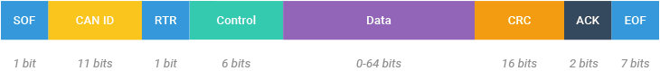

# TEAM ANVESHAK

##  ESP32 CAN RECEIVER DOCUMENTATION

This README file is the documentation for script __ESP32_Can_Receiver.ino__ program in the path *__Anveshak-Files/ESP32_Can_Receiver/__*

Author : __Sanjeev Subrahmaniyan__ <br>
Last Edited : 19 July 2024 <br>

---

This ESP32 program is used to receive PWM and direction data for the motor drivers on the rover using the CAN protocol and dataframe(from another source, likely the controller) and use PWM writing methods to control the motor drivers; speed and direction.

It also monitors and handles the encoder values using an interrupt which is triggered when the encoder output values change on either bit.

---

## TABLE OF CONTENTS

1. Overview of CAN framework
2. Pin configurations and purpose
3. Initialization methods
4. Flow of control and logic handling
5. Motor control and handling
6. Encoder control and handling
7. Variable intuition

While each section can be independently understood, it is reccomended to understand the variables and control flow before using the entire program.

---

### Overview of CAN framework

The CAN is a framework used for efficient communication in networks of mobile devices and has a number of advantages over other communication protocol. A CAN bus generally has two wires TX and RX which are wrapped tight to minimize difference in interference. The messages are transmit in frames consisting of different parts as shown below.
<br>



CAN can be used in ESP32 using the header import CAN.h

```cpp
void onReceive(int packetSize)
{
  int f=0;
  while (CAN.available()) 
  {
    char k = (char) CAN.read();
    number[f] = static_cast<uint8_t>(k);
    f=f+1;      
  }
  checkprint = 1;
  movemotorsok = 1;
}
```
This program is called everytime a new frame is sent through the network which updates the values in the `number[]` array.

The function `CAN.read()` reads the message frame and extracts the information in the data part of the frame and stores it as raw bytes in the `number[]` array.

---

### Pin configurations and purpose

The `#define` lines in a ESP32 script specify the mapping between different I/O pins and the purpose served by them.

```cpp
#define TX_GPIO_NUM   26
#define RX_GPIO_NUM   25
```
This maps the transmission and reciever pins of the can bus on the ESP32.

```cpp
#define AIN1 18
#define AIN2 19
#define BIN1 17
#define BIN2 16
```
The program handles two H-bridge motor drivers labelled A and B. The pins specified above are the two terminals of the respective motor drivers. The combination of two terminals enables bidirectional control for those motor drivers. The values on the two terminals of each motor driver can be (1,0), (0,1) to control the direction of rotation.

```cpp
#define PWMA 21
#define PWMB 4
#define PWMC 2
```
These lines define the pins for the PWM outputs for the motor drivers. They essentially control the speed of rotation of the motor drivers relative to its maximum capacity.

```cpp
#define DIRC 15
```
The motor C is not H-bridge and its direction can directly be controlled by the value on the `DIRC` pin.

---

### Initialization methods

The function `setup()` is used to initialize the module for functioning. The different subparts of it are:

`Serial.begin(115200)` establishes serial communication between the ESP32 and output device(like a computer) at the rate of 115200 bauds.

`CANinit()`:
```cpp
void CANinit()
{
  Serial.println ("CAN Receiver");

  CAN.setPins (RX_GPIO_NUM, TX_GPIO_NUM);

  if (!CAN.begin(500E3)) {
    Serial.println("Starting CAN failed!");
    while (1);
  }

  CAN.onReceive(onReceive);
}
```
This method sets up the I/O pins for the CAN controller and prints an error message if the configuration is unsuccessful. It also calls `CAN.onReceive()` with the pointer to another function `onReceive` which gets called everytime the CAN controller receives a Start of Frame(SOF) bit.

`pinmodeinit()`:
```cpp
void pinmodeinit()
{
  pinMode(AIN1,OUTPUT);
  pinMode(AIN2,OUTPUT);
  pinMode(BIN1,OUTPUT);
  pinMode(BIN2,OUTPUT);
  pinMode(DIRC,OUTPUT);
  pinMode(SGNL,INPUT);

  ledcSetup(0, freq, resolution);
  ledcSetup(1, freq, resolution);
  ledcSetup(2, freq, resolution);
  ledcAttachPin(PWMA, 0);
  ledcAttachPin(PWMB, 1);
  ledcAttachPin(PWMC, 2);

  attachInterrupt(digitalPinToInterrupt(encA[0]), updateEncoder0, CHANGE);
  attachInterrupt(digitalPinToInterrupt(encA[1]), updateEncoder0, CHANGE);
  
}
```
This function sets up all the motor driver control pins to the `OUTPUT` configuration(as they send data to the motors).

#### An overview of LEDC

The `ledcSetup()` configures the corresponding ledc channel with the specified frequency and resolution. LEDC is used to utilize PWM to send the necessary signals in the GPIO pins.

The frequency of a LEDC channel specifies the number of cycles per second in the PWM data. A greater frequency helps to control the output PWM with greater precision but has switching noise as a drawback.

The resolution specifies the number of bits in the PWM value. For example, in this code the resolution is 8, which means the PWM value can range between 0 and 255.

`ledcAttachPin()` is used to connect the ledc channel to the GPIO pins specified above.

`attachInterrupt()` method implements interrupts in the ESP32. interrupts are used when a particulat funtion(here, `updateEncoder0`) needs to be called when the argument changes its value.

---

### Flow of control and logic handling

The control flow of the program is best described in the flowchart below


---

### Motor control
In the `loop()` function, which get called continuously as long as the program is running, the code snippet is used to control the motor drivers with the data received through the CAN network.

```cpp
if(movemotorsok == 1)
{
ledcWrite(0,number[0]);
ledcWrite(1,number[1]);
ledcWrite(2,number[2]);

digitalWrite(15,number[5]);

digitalWrite(18,other[number[3]]);
digitalWrite(19,otherother[number[3]]);

digitalWrite(16,other[number[4]]);
digitalWrite(17,otherother[number[4]]);
movemotorsok = 0;
}
```
`ledcWrite()` writes the PWM value in `number[]` to the corresponding channel. This is then handled and routed to the GPIO pin the ledc channel is connected to.

The `digitalWrite()` methods here setup the direction of rotation of motor drivers A and B(with H-bridge) and C using the `DIRC` variable. These directions are sources logically from the CAN message frame as mentioned above.

---

### Encoder control

The function `updateEncoder0()` is setup as an interrupt with the encoder pins. This means the function will be called everytime the value of the encoder pins change.

```cpp
void updateEncoder0()
{
  int MSB = digitalRead(encA[0]); //MSB = most significant bit
  int LSB = digitalRead(encA[1]); //LSB = least significant bit
  int encoded = (MSB << 1) |LSB; //converting the 2 pin value to single number
  int sum  = (lastEncoded << 2) | encoded; //adding it to the previous encoded value

  if(sum == 0b1101 || sum == 0b0100 || sum == 0b0010 || sum == 0b1011) enc_pos --;
  if(sum == 0b1110 || sum == 0b0111 || sum == 0b0001 || sum == 0b1000) enc_pos ++;
  
  lastEncoded = encoded; //store this value for next time
}
```
Here, the encoder pins `encA[]` are logically handled and converted into a 4-bit number `sum` using the present and previous encoder value. This value is then used to increment or decrement `enc_pos` variable which denotes the position of the motors.
<br>
__This is smartly handled using gray code(reduces error in switching) for the encoder readings. The encoder readings are in the order 00->01->11->10->00. This means, if the encoder reading was 01 in one instant and 11 in the next, the logic can be used to increment the `enc_pos` variable smartly.__

---

### Variable intuition

The variables `freq` and `resolution` are used to specify the PWM parameters for the ledc channels are mentioned above.

`uint8_t number[8]` is used as an integer array to hold the following data: [PWMA, PWMB, PWMC, DIRA, DIRB, DIRC, _, _]. This gives an efficient and simple way to handle all the values for all the motors together.

Control variables like `checkprint` and `movemotorsok` are used to ensure the debug information and motor output lines are changed only when a new dataframe is received on the CAN bus.

All of the encoder variables are obvious and can be understood from the previous part of the documentation.

---
